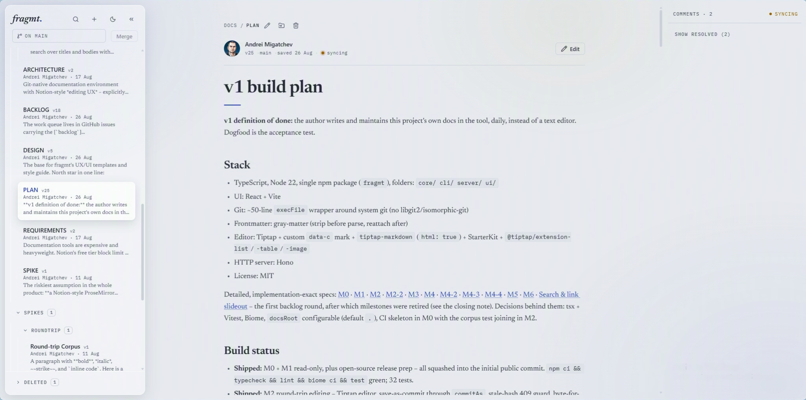

# fragmt

[](https://www.npmjs.com/package/fragmt)
[](https://github.com/ChaosChild/fragmt/actions/workflows/ci.yml)
[](LICENSE)
[](package.json)

**Notion-style editing over the plain markdown already in your git repo.**

Your repo is the storage. Docs stay ordinary markdown – readable on GitHub,
diffable, reviewable through PRs, and directly usable by AI coding agents.
Every save is a git commit under your own identity. Delete fragmt tomorrow and
you still have a folder of markdown and its full history.



```sh
npx fragmt init     # inside any git clone containing markdown
npx fragmt serve    # opens the editor
```

Requires Node 22+.

---

## Why

Documentation tools make you choose between a good editor and owning your
content.

Notion and Confluence give you the editor and keep the content in their
database – export is lossy, history lives in their pane instead of your
toolchain, and your coding agent can't read any of it without an API
integration. Plain markdown in git gives you ownership, review and
agent-readability, but the editing experience is a text editor.

fragmt refuses the trade.

|  | Notion / Confluence | Markdown + text editor | **fragmt** |
| --- | --- | --- | --- |
| Storage | vendor database | your repo | **your repo** |
| Editing | WYSIWYG | text editor | **WYSIWYG** |
| Diff and review | their version history | `git diff` / PRs | **`git diff` / PRs** |
| Agent-readable | via API | yes | **yes, first-class** |
| Cost at 5 seats | per seat, monthly | free | **free** |
| Self-host seat limit | capped or licensed | – | **none** |

**What it is not:** an open-source Notion clone – only the editing UX is
Notion-style – and not a CMS. The emphasis is documentation. Nearest relative is
Wiki.js, differentiated by being agentic-ready from the ground up: the agent
surface is the CLI itself, riding the same core library as the UI.

## What you get

- **Notion-style WYSIWYG** over plain markdown. Selection and right-click
  bubbles for headings, quotes, links and tables; a `/` menu for blocks and
  images. No markdown knowledge required.
- **Save is a commit.** Frontmatter preserved byte-for-byte, a stale-base-hash
  guard against concurrent edits, and your real git identity on every commit.
- **Main is protected**, whether the branch actually is or not. Editing a doc on
  main starts a draft branch automatically; a global **Merge** button lands it.
- **Merge conflicts resolve in the tool** – per-hunk ours/theirs or a free-edit
  box, structural merging for comment sidecars, one concluding commit.
- **Inline comments** anchored to text as marks in the markdown itself, threads
  versioned in JSON sidecars. No comment backend.
- **Ctrl/Cmd+K search** across titles and bodies, and a side-by-side preview
  pane for reading one doc against another.
- **Full file lifecycle** – create, rename, move, delete, drag and drop, a
  recycle bin, `.gitignore` respected, `@` references between docs.
- **Agents are first-class users** – see [Agents](#agents).

## Install

```sh
npx fragmt init      # scaffold: writes .fragmt.json, adopts existing markdown
npx fragmt serve     # start the editor, prints the URL
```

Or globally: `npm i -g fragmt`, then `fragmt init` and `fragmt serve`.

`init` must run inside a git clone. It never overwrites an existing config – a
second run prints `already initialized` and exits 0. Scope it to a subfolder
with `fragmt init --root docs`.

> **Platforms:** tested on Windows. Linux and macOS verification is in progress
> – reports from those platforms are welcome.

## CLI

```
fragmt init [--root <path>]
fragmt serve [--port <n>]
fragmt agent [status]
fragmt agent comment <doc> [--thread <id>] [--body <text>] [--resolve] [--author <who>] [--full]
fragmt agent draft <doc> [--merge]
fragmt --help
```

## Agents

AI coding agents are first-class users, and the contract is the `fragmt agent`
CLI – token-lean output, aggregates inline, next-step hints, exit codes 0/1/2,
no interactive prompts.

| Verb | What it does |
| --- | --- |
| `fragmt agent status` | Branch, protected-main mark, draft map, merge state |
| `fragmt agent comment docs/x.md` | List threads; `--thread <id>` for detail, `--full` for untruncated bodies |
| `fragmt agent comment docs/x.md --thread <id> --body "…"` | Reply on a thread (one commit) |
| `fragmt agent comment docs/x.md --thread <id> --resolve` | Resolve a thread |
| `fragmt agent draft docs/x.md` | Start or reuse the doc's draft branch |
| `fragmt agent draft docs/x.md --merge` | Merge the draft into main |

Doc bodies are plain markdown, so agents read and diff them directly; the CLI
matters for drafts, comments and merge state. Mutations accept `--author`
(`Name <address>`) so an agent's commits carry its own identity – list the name
under `agents` in `.fragmt.json` and the UI marks its comments with a chip.

`fragmt init` also writes a delimited `<!-- fragmt:begin -->…<!-- fragmt:end -->`
block into `AGENTS.md`, teaching any agent the drafting rules. Nothing outside
the markers is touched.

## Configuration

`.fragmt.json` at the repo root is the whole configuration surface:

```json
{
  "docsRoot": ".",
  "order": {},
  "authors": { "you@example.com": "YourGitHubUsername" },
  "agents": ["ZCode"]
}
```

| Key | Meaning |
| --- | --- |
| `docsRoot` | Path, relative to the repo root, that fragmt treats as the doc tree. `"."` is the whole repo. |
| `order` | Reserved for explicit doc ordering (v1.x). Always `{}` for now. |
| `authors` | Optional map of commit emails to GitHub usernames, for avatars. |
| `agents` | Optional list of agent display names; their comments get an `agent` chip. |

Parsing is strict – a malformed config fails loudly with the file path rather
than falling back to a silent default.

## Status

**Beta.** The full v1 feature set works. What stands between this and 1.0 is
dogfood hardening – a long-running effort that closes when it closes, not on a
schedule.

## Documentation

Reference docs live in [`docs/`](docs/): [architecture](docs/ARCHITECTURE.md)
and [design principles](docs/DESIGN.md).

The design decisions, the build log and the wrong turns – including why Tiptap
won the editor spike and what was deliberately cut from v1 – are written up at
**[migatchev.co.za/projects/fragmt](https://migatchev.co.za/projects/fragmt)**.

## Contributing

See [CONTRIBUTING.md](CONTRIBUTING.md). Scope is deliberately tight, so open an
issue before a large PR. The most useful contribution right now is dogfooding
and issue reports – especially on Linux and macOS.

Built with TypeScript, Node 22, [Hono](https://hono.dev), React 19 + Vite,
[Tiptap 3](https://tiptap.dev), and a thin `execFile` wrapper around system git.

## License

MIT – see [LICENSE](LICENSE). Copyright © 2026 Andrei Migatchev and
[contributors](https://github.com/ChaosChild/fragmt/graphs/contributors).
